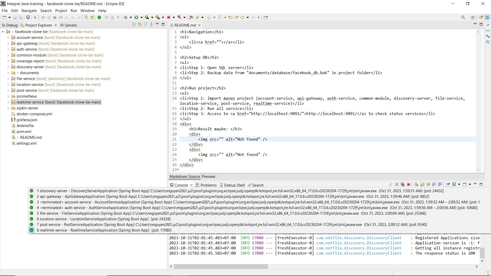
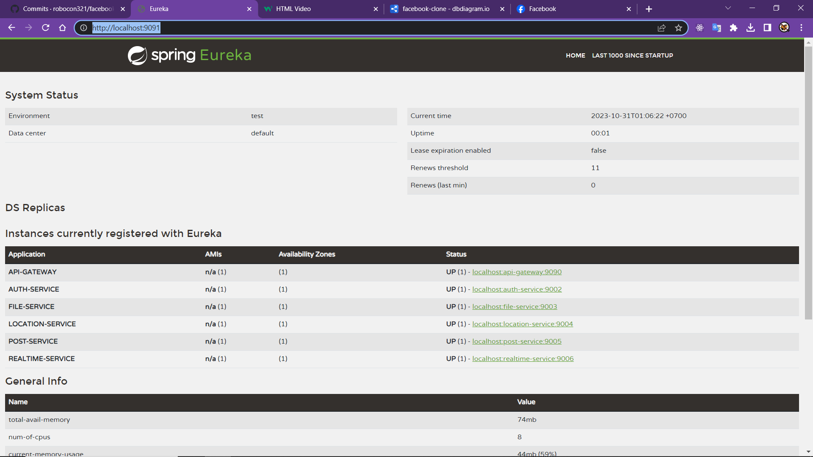
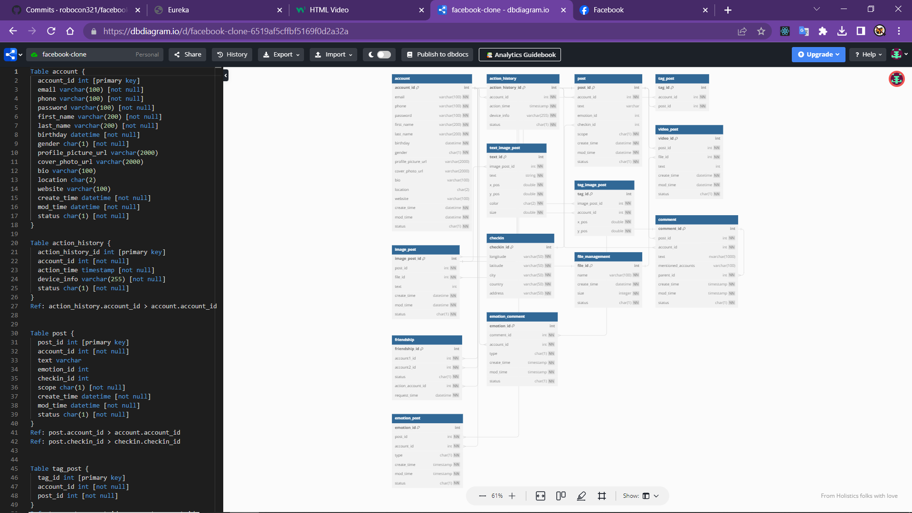
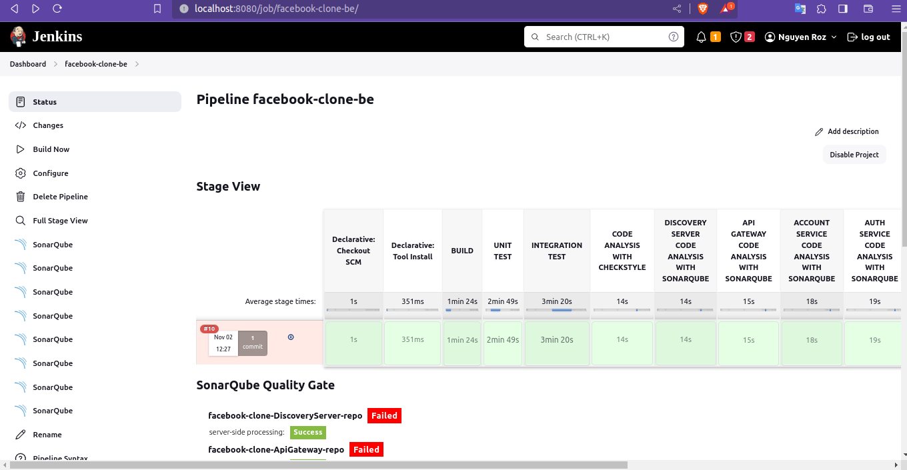
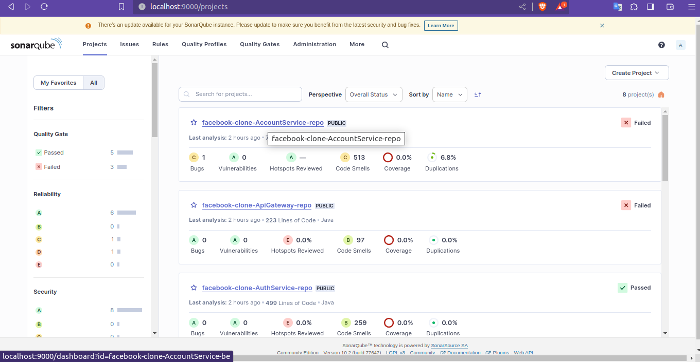
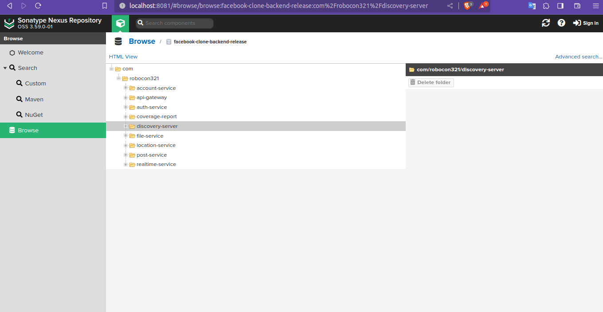

<h1>Table of contents</h1>
<ol>
	<li><a href="#setup-db">Setup DB</a></li>
	<li><a href="#run-project">Run project</a></li>
	<li><a href="#db-design">DB Design</a></li>
	<li><a href="https://github.com/robocon321/facebook-clone-fe">Frontend</a></li>
	<li><a href="#jenkins-be">Jenkins</a></li>
	<li><a href="#sonarqube-be">Sonarqube</a></li>
	<li><a href="#nexus-be">Nexus</a></li>	
</ol>

<h2 id="setup-db">Setup DB</h2>
<ul>
<li>Step 1: Open SQL server</li>
<li>Step 2: Backup data from "documents/database/facebook_db.bak" in project folder</li>
</ul>

<h2 id="run-project">Run project</h2>
<ul>
<li>Step 1: Import maven project (account-service, api-gateway, auth-service, common-module, discovery-server, file-service, location-service, post-service, realtime-service)</li>
<li>Step 2: Run all service</li>
<li>Step 3: Access to <a href="http://localhost:9091/">localhost:9091</a> to check status services</li>
</ul>

	<h3>Result maybe: </h3>
	

				
	

	

		
 	

<h2 id="db-design">DB design</h2>

Access to <a href="https://dbdiagram.io/">dbdiagram.io</a> and copy table code in "documents/database/DB.txt" in project folder

<h3>Result: </h3>

	

<h2 id="jenkins-be">Jenkins</h2>

	

<h2 id="sonarqube-be">Sonarqube</h2>

	

<h2 id="nexus-be">Nexus</h2>

	

